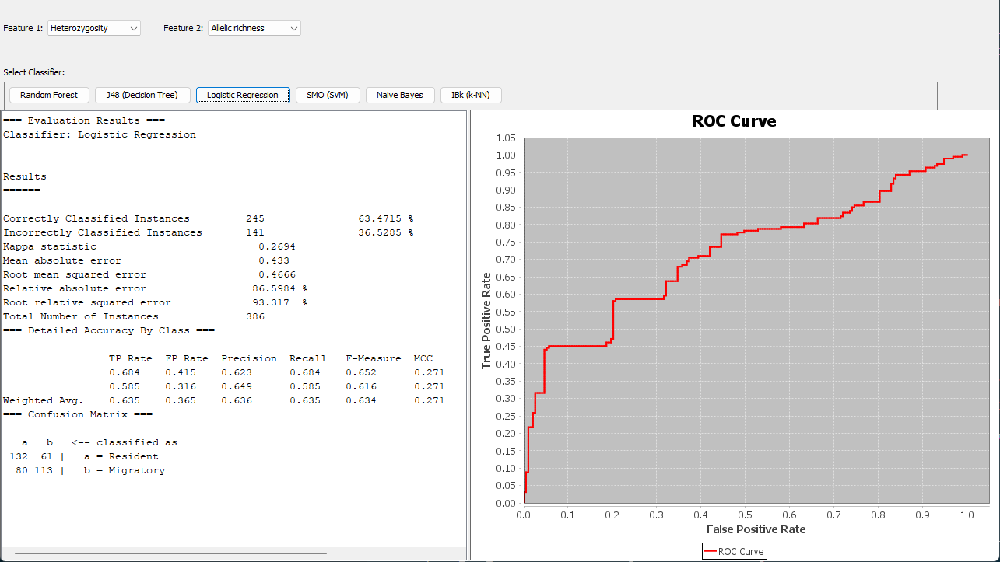

# Bird Migratory Status Predictor

By Saipriya Kotcharlakota

The **Bird Migratory Status Predictor** is a Java-based machine learning application designed to classify bird species as either "Resident" or "Migratory" based on user-selected numerical features from a dataset. This tool provides an intuitive graphical interface for loading datasets, selecting features, choosing among multiple machine learning classifiers, and visualizing performance metrics such as evaluation results and ROC curves. The project emphasizes usability, with built-in safeguards against invalid selections and errors, ensuring a seamless experience for researchers and enthusiasts working with biological or ecological datasets.



---

### **Requirements and Dependencies**

This application leverages several Java libraries for its functionality:

1. **Weka Library**: Used for machine learning algorithms, data preprocessing, and evaluation metrics. It supports a wide range of classifiers such as Random Forest, Logistic Regression, and SVM.
2. **JFreeChart Library**: Used for generating and displaying the ROC curves, enabling the visualization of classifier performance in terms of True Positive and False Positive Rates.
3. **Java Swing**: Provides the graphical user interface, including components for file selection, feature selection, classifier buttons, and results display.

---

### **Challenges Addressed**

1. **Feature Selection Recursion**:
   - Initial implementations encountered recursive updates when selecting features, leading to stack overflow errors. This was resolved by introducing flags to manage and suppress recursive event handling during updates to the feature combo boxes.

2. **Dataset Loading**:
   - Many CSV datasets contain a mix of numerical, categorical, and nominal data. The application dynamically identifies and filters numerical features while ensuring the class attribute ("Migratory status") is valid and present.

3. **Balanced Class Representation**:
   - Ensuring the dataset has a balanced representation of classes ("Resident" and "Migratory") was critical for generating meaningful ROC curves. A resampling technique was implemented to handle imbalanced datasets effectively.

4. **ROC Curve Accuracy**:
   - Earlier versions displayed flat or incorrect ROC curves due to improper handling of probability distributions. The application now sorts predictions by descending probabilities and calculates True Positive and False Positive Rates dynamically.

---

### **Run Instructions**

1. **Compilation**:
   - Ensure you have Java installed and set up on your system, along with the required libraries (Weka and JFreeChart) in the `lib/` folder.
   - Navigate to the root directory of the project in your terminal.
   - Compile the program using the following command:
     ```
     javac -cp .;lib/* -d build src/BirdMigratoryStatusPredictor.java
     ```

2. **Execution**:
   - Run the compiled program using the command:
     ```
     java --add-opens java.base/java.lang=ALL-UNNAMED -cp build;lib/* BirdMigratoryStatusPredictor
     ```

---

### **Using the Application**

1. **Loading a Dataset**:
   - Click the "Browse" button to load a CSV file. The dataset must contain a nominal class attribute labeled "Migratory status" and at least one numeric feature.

2. **Selecting Features**:
   - Use the dropdowns to select two distinct numerical features for training. The application prevents duplicate selections to avoid crashes or redundancy.

3. **Choosing a Classifier**:
   - Click on one of the classifier buttons (e.g., Random Forest, Logistic Regression). The application trains the selected model and evaluates its performance using the current feature selections.

4. **Viewing Results**:
   - Evaluation metrics such as accuracy, confusion matrix, and class-wise precision are displayed in the left panel.
   - The ROC curve is visualized in the right panel, representing the classifier's ability to distinguish between "Resident" and "Migratory" classes.

---

This application is a practical tool for understanding and evaluating machine learning models in biological and ecological contexts. It also provides a learning platform for working with classifiers, data preprocessing, and visualizations in Java.